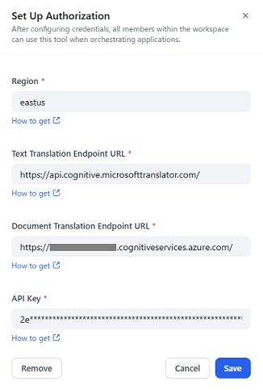

# Overview

This extension provides a simple way to translate text using Azure AI Translator.

## Important Notice

This plugin requires an Azure subscription. If you don't have an Azure subscription, create a free account before you begin. Learn more about the free trial [here](https://azure.microsoft.com/free/).

# Tools provided by this plugin

## Text Translation

Text Translation provides a simple way to translate text between multiple languages. Returns single source-language text to multiple target-language texts with a single request.

Learn more about Text Translation [here](https://learn.microsoft.com/azure/ai-services/translator/text-translation-overview).

## Document Translation

Document Translation translates can translate complex documents in various formats while preserving the document's layout and structure. 

Learn more about Document Translation [here](https://learn.microsoft.com/azure/ai-services/translator/document-translation/overview).

### Important Notice
This tool provides Syncronous Translation only.
For more information, such as supported language and file formats, please see [here](https://learn.microsoft.com/azure/ai-services/translator/document-translation/overview#synchronous-translation).

# Configuration

## 1. Create a resource in the Azure portal

Create an Azure Translator resource in the Azure portal.

## 2. Get the endpoint and key from the Azure portal

After creating the resource, get the **Text Translation Endpoint**, **Document Translation Endpoint**, **Region** and **API Key** from the Azure portal.

## 3. Install the plugin

Install the plugin by clicking on the **Install** button.

## 4. Authorize the plugin

Open the plugin, and click on the **To Authorize** button.

Input the **Region**, **Text Translation Endpoint**, **Document Translation Endpoint** and **API Key** you obtained from the Azure portal, and click on the **Save** button.

## 5. Use the tools provided by the plugin

Add tool to the canvas and configure it.

# Report Issues and Contributing

Please report any issues to the [GitHub repository](https://github.com/fujita-h/dify-plugin-azure-ai-translator).  
This plugin is open-source and contributions are welcome.
